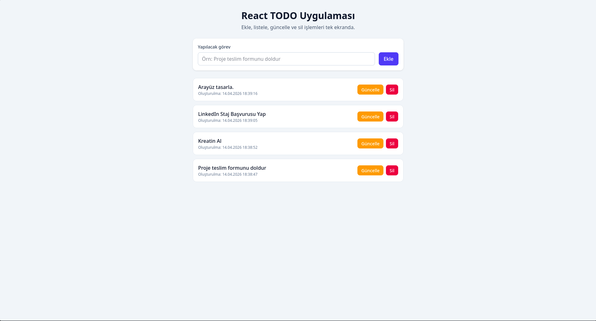

# ReactJS TODO App (TypeScript + Tailwind CSS)

Bu proje eğitim gereksinimlerine göre geliştirilmiş bir TODO uygulamasıdır

## Özellikler

- **Ekleme (Create)**
- **Listeleme (Read)**
- **Güncelleme (Update)**
- **Silme (Delete)**
- LocalStorage ile verileri tarayıcıda saklama

## Kullanılan Teknolojiler

- ReactJS
- TypeScript
- Tailwind CSS
- Vite

## Klasör Yapısı

```text
src/
  Components/
    TodoForm.tsx
    TodoItem.tsx
    TodoList.tsx
  Pages/
    Home.tsx
  Interfaces/
    ITodo.ts
```

## Kurulum ve Çalıştırma

```bash
npm install
npm run dev
```

## Build

```bash
npm run build
```

## Proje Ekran Görüntüsü



